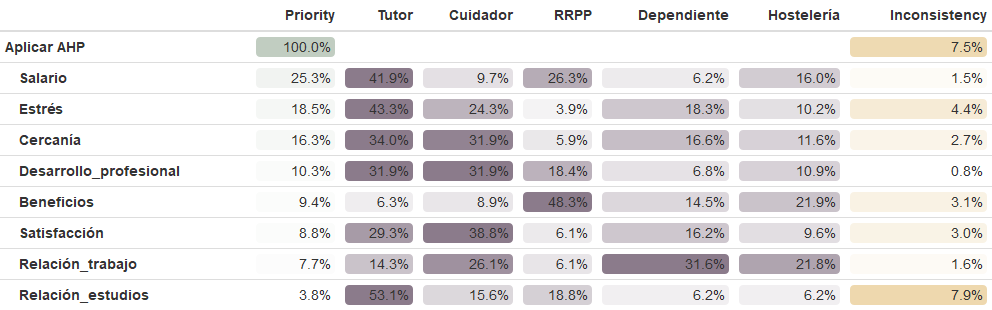

\pagebreak

ENLACES:
https://modelocurriculum.net/blog/trabajos-perfectos-para-compaginar-con-los-estudios

# INTRODUCCIÓN

He elegido este tema porque es un problema que afecta a muchos estudiantes universitarios que buscan equilibrar sus estudios con un empleo que les permita cubrir sus gastos y adquirir experiencia laboral relevante. La elección del tipo de empleo adecuado puede influir significativamente en el rendimiento académico y en la calidad de vida del estudiante. Además, este tema es relevante en el contexto actual, donde muchos estudiantes enfrentan desafíos financieros y buscan oportunidades laborales que se adapten a sus horarios y necesidades. Al analizar las diferentes opciones de empleo, se pueden considerar factores como la flexibilidad horaria, la remuneración, la relevancia para la carrera académica y el ambiente laboral. Este análisis puede ayudar a los estudiantes a tomar decisiones informadas sobre qué tipo de empleo es más adecuado para ellos, permitiéndoles maximizar tanto su desarrollo académico como profesional.

Es un tema que me motiva debido a que ha sido una decisión que he tenido que tomar en el pasado, ya que necesitaba un empleo que pudiera compaginar con mi estudio en la universidad, y es una decisión que tienen que tomar mucho de los estudiantes universitarios año tras año.

# DEFINICIÓN DEL PROBLEMA

El problema consiste en seleccionar el mejor tipo de empleo para un estudiante universitario que busca equilibrar sus estudios con un trabajo que le permita cubrir sus gastos y adquirir experiencia laboral relevante. Se deben considerar varios criterios y alternativas para tomar una decisión informada mediante el uso de las técnicas de toma de decisiones multicriterio (AHP, ELECTRE, PROMETHEE).

# ALTERNATIVAS (OPCIONES DE EMPLEO)

Vamos a considerar 4 tipos de empleo comunes entre los estudiantes universitarios:

A1: EMPLEO EN HOSTELERÍA/SERVICIOS.

DESCRIPCIÓN: Camarero, repartidor o trabajador en un bar. Horarios fijos, a menudo suelen ser los fines de semana. 

A2: PROFESOR PARTICULAR/TUTOR.

DESCRIPCIÓN: Dar clases particulares a otros estudiantes. Horarios flexibles, generalmente por las tardes o fines de semana cuando al estudiante le venga mejor por su organización.

A3: RRPP/PROMOTOR DE EVENTOS.

DESCRIPCIÓN: Trabajar en la promoción de eventos, productos o servicios, además de captar gente para el local en el que trabaje. Suelen ser trabajos con horarios nocturnos y fines de semana. 

A4: DEPENDIENTE/A.

DESCRIPCIÓN: Es uno de los empleos más solicitados entre los estudiantes. Muchas tiendas de ropa, calzado y complementos ofrecen puestos de trabajo a media jornada, ideal para jóvenes estudiantes apasionados por la moda.

A5: CUIDADOR DE NIÑOS.

DESCRIPCIÓN: Fácil empleo para los estudiantes con horario flexible, que puede adaptarse a la organización del estudiante.

# CRITERIOS Y SUBCRITERIOS

Hemos definido cuatro criterios principales y un total de 8 subcriterios para evaluar las alternativas de empleo:
     
C1. Remuneración e impacto financiero 

   - Subcriterios:
   
     C1.1. Salario por hora. Tenemos que maximizar,
     queremos ganar el mayor dinero posible.
     ESCALA: Valor en euros por hora.
     
     C1.2. Beneficios adicionales. Tenemos que maximizar,
     ya que si ganamos algo más aparte del salario normal
     es beneficioso para nosotros.
     ESCALA: Escala del 1 (bajo) al 5 (alto) para reflejar
     descuentos, propinas...
     
OBJETIVO: Maximizar la remuneración total y los beneficios financieros asociados al empleo, ya que vamos a tener más dinero para ahorrar y cubrir nuestras necesidades.
     
C2. Impacto académico

   - Subcriterios:
   
     C2.1. Cercanía al hogar. Tenemos que maximizar, para
     que este trabajo no suponga desplazarnos y perder más
     tiempo, ya que siendo estudiantes no es algo que nos
     sobre.
     ESCALA: Escala del 1 (lejos) al 10 (muy
     cerca/teletrabajo).
     
     C2.2. Carga mental/estrés. Tenemos que minimizar, para
     que el trabajo no sea una carga en nuestra vida.
     ESCALA: Escala del 1 (muy bajo) al 10 (muy alto).
     
OBJETIVO: Minimizar, ya que buscamos que el impacto negativo del empleo en el rendimiento académico sea mínimo, y que el trabajo no suponga un estrés adicional en nuestra vida que pueda llegar a interferir con los estudios. Queremos sobre todo el bienestar del estudiante. 
     
C3. Relevancia para la Carrera Académica

   - Subcriterios:
   
     C.3.1. Oportunidades de desarrollo profesional. 
     Tenemos que maximizar, para que nos beneficie todo lo
     posible.
     ESCALA: Escala del 1 (bajo) al 10 (alto).
     
     C.3.2. Relación con los estudios. Tenemos que
     maximizar, para que también nos ayude en nuestra
     formación.
    ESCALA: Escala del 1 (bajo) al 10 (alto).
     
OBJETIVO: Maximizar, ya que buscamos que el empleo tenga una relación directa con la carrera académica del estudiante, proporcionando experiencia relevante y oportunidades de desarrollo profesional que puedan beneficiar su futuro laboral.
     
C4. Desarrollo personal

   - Subcriterios:
   
     C.4.1. Satisfacción personal. Tenemos que maximizar,
     para que el trabajo nos haga sentir bien en nuestro
     día a día y cuando vayamos.
     ESCALA: Escala del 1 (bajo) al 10 (alto).
    
     C.4.2. Relaciones con compañeros y jefes. Tenemos
     que maximizar, ya que es un aspecto importante siempre
     en un trabajo. Se trabaja mejor con personas con las
     que te lleves bien y tengas buena relación. 
     ESCALA: Escala del 1 (bajo) al 10 (alto).
     
OBJETIVO: Maximizar, ya que buscamos que el empleo contribuya al crecimiento personal del estudiante, proporcionando un ambiente de trabajo positivo y oportunidades para desarrollar habilidades interpersonales y profesionales.

# MÉTODO ELECTRE 

Tenemos que maximizar los subcriterios C1.1, C1.2, C2.1, C3.1, C3.2, C4.1 y C4.2, y solo tenemos que minimizar el subcriterio C2.2.

Los pesos asignados a cada uno de estos subcriterios son: W=(0.25, 0.10 , 0.15, 0.15, 0.05, 0.05, 0.15 , 0.10).

La matriz de decisión viene recogida en la siguiente tabla: 

```{r tabla-electre, echo=FALSE}

matriz_decision_data <- data.frame(
  Salario = c(8, 15, 10, 9, 12),
  Beneficios = c(2, 1, 5, 1, 3),
  Cercania = c(3, 8, 5, 7, 7),
  Estres = c(7, 2, 8, 6, 5),
  Desarrollo = c(4, 8, 5, 5, 3),
  Relacion_Estudios = c(1, 9, 2, 3, 5),
  Satisfaccion = c(6, 9, 7, 5, 8),
  Relaciones = c(8, 3, 10, 7, 5),
  row.names = c("Hostelería", "Tutor", "RRPP", " Dependiente", "Cuidador")
)

library(knitr)
kable(
  matriz_decision_data,
  caption = "Matriz de Decisión (Método ELECTRE)",
  align = 'c'
)
```

Vamos a trabajar con un valor del umbral de concordancia (alpha) igual a 0.65, y un vector de umbrales de
discordancia (d) igual a (6,4,5,4,6,4,5,5).

Ahora procedemos a aplicar el método ELECTRE para ordenar las alternativas.

```{r,echo=TRUE}

source("teoriadecision_funciones_multicriterio.R")
source("teoriadecision_funciones_multicriterio_utiles.R")

metodo_electre = multicriterio.crea.matrizdecision(c(8,2,3,7,4,1,6,8,
15,1,8,2,8,9,9,3,
10,5,5,8,5,2,7,10,
9,1,7,6,5,3,5,7,
12,3,7,5,3,5,8,5),
numalternativas = 5,
numcriterios = 8)

metodo_electre

```
```{r,echo=TRUE}

salida_electre= multicriterio.metodoELECTRE_I(metodo_electre, pesos.criterios=
c(0.25, 0.10 , 0.15, 0.15, 0.05, 0.05, 0.15 , 0.10), nivel.concordancia.minimo.alpha=0.65, no.se.compensan=c(6,4,5,4,6,4,5,5),que.alternativas = TRUE)

salida_electre

```

```{r,echo=TRUE,fig.align='center'}

qgraph::qgraph(salida_electre$relacion.dominante)

```
En este grafo de dominancia se representa visualmente la relación de superación obtenida al aplicar los test
de concordancia y discordancia. Los resultados obtenidos son:

A2 domina a a5. A5 domina a las alternativas A1 y A4. A3 domina a las alternativas A4 y A1.

```{r,echo=TRUE}

salida_electre$nucleo_aprox

```
Este es el núcleo aproximado, que es el conjunto de soluciones que no son dominadas por otras alternativas.
El resultado es A2 y A3. Esto nos indica que las alternativas “Profesor particular/Tutor” y “RRPP/Promotor
de eventos” son las más adecuadas, ya que ninguna de las otras opciones logró superarlas tras la aplicación
de los subcriterios y umbrales.

Para intentar quedarnos con una única alternativa óptima, vamos a reducir el grafo a las alternativas en el núcleo aproximado. Aplicamos el método ELECTRE de nuevo para ver si una alternativa domina a la otra en este subconjunto.

```{r,echo=TRUE,fig.align='center'}

salida_electre_b= multicriterio.metodoELECTRE_I(metodo_electre, pesos.criterios=
c(0.25, 0.10 , 0.15, 0.15, 0.05, 0.05, 0.15 , 0.10), nivel.concordancia.minimo.alpha=0.65, no.se.compensan=c(6,4,5,4,6,4,5,5),que.alternativas = c(2,3))

qgraph::qgraph(salida_electre_b$relacion.dominante)

```
El grafo nos indica que no hay dominancia de una alternativa sobre la otra, ya que no aparece ninguna flecha.

```{r,echo=TRUE}

salida_electre_b$nucleo_aprox

```
Después de reducir el análisis al subconjunto A2,A3, seguimos teniendo que el núcleo aproximado final sigue
siendo A2,A3. Los números 1 y 2 solo indican el orden de estas alternativas en el subconjunto.

Ahora vamos a probar a reducir el umbral alpha para ver si alguna alternativa domina a la otra e intentar
resolver la incomparabilidad. Si ajustamos los umbrales podemos intentar forzar esta dominancia para
seleccionar una única alternativa óptima.

```{r,echo=TRUE,fig.align='center'}

salida_electre_c= multicriterio.metodoELECTRE_I(metodo_electre, pesos.criterios=
c(0.25, 0.10 , 0.15, 0.15, 0.05, 0.05, 0.15 , 0.10), nivel.concordancia.minimo.alpha=0.10, no.se.compensan=c(6,4,5,4,6,4,5,5),que.alternativas = c(2,3))

qgraph::qgraph(salida_electre_c$relacion.dominante)

```
Probando a reducir el valor de alpha numerosas veces hasta llegar a un límite extremadamente permisivo
(0.10), sigue sin aparecer dominancia en el grafo. Esto indica que necesitamos modificar también los valores
del vector de discordancia.

```{r,echo=TRUE,fig.align='center'}

salida_electre_d= multicriterio.metodoELECTRE_I(metodo_electre, pesos.criterios=
c(0.25, 0.10 , 0.15, 0.15, 0.05, 0.05, 0.15 , 0.10), nivel.concordancia.minimo.alpha=0.65, no.se.compensan=c(6,5,5,7,6,4,5,8),que.alternativas = c(2,3))

qgraph::qgraph(salida_electre_d$relacion.dominante)

```

Tras probar una serie de valores para el vector de discordancia, se obtiene que A2 domina a A3 con d=(6,5,5,7,6,4,5,8), que es el vector de discordancia mínimamente ajustado. Tras observar esta solución, podemos decir que la alternativa A2 domina a la alternativa A3, por lo que la mejor opción es “Profesor particular/Tutor”.

# CÁLCULOS EN EL MÉTODO ELECTRE I

```{r,echo=TRUE}

e1 = func_ELECTRE_Completo(salida_electre)

e1$Grafo

```

```{r,echo=TRUE,fig.align='center'}

qgraph::qgraph(e1$Grafo)

```

```{r,echo=TRUE}

e1$Nucleo

```
Con el método ELECTRE I nos salen los mismos resultados que con el método ELECTRE anterior. El núcleo sigue estando compuesto por las alternativas 2 y 3, y siguen existiendo las mismas dominancias entre las alternativas, como vemos con el código e1$Grafo.

# MÉTODO PROMETHEE

Tenemos que maximizar los subcriterios C1.1, C1.2, C2.1, C3.1, C3.2, C4.1 y C4.2, y solo tenemos que minimizar el subcriterio C2.2. Para crear la matriz para este método, multiplicamos la columna del subcriterio 2.2 por -1.

```{r,echo=TRUE}

source("teoriadecision_funciones_multicriterio.R")
source("teoriadecision_funciones_multicriterio_utiles.R")

tabdecision_promethee = multicriterio.crea.matrizdecision(c( 8, 2, 3, -7, 4, 1, 6, 8, 15, 1, 8, -2, 8, 9, 9, 3, 10, 5, 5, -8, 5, 2, 7, 10, 9, 1, 7, -6, 5, 3, 5, 7, 12, 3, 7, -5, 3, 5, 8, 5), numalternativas = 5, numcriterios = 8, v.nombresalt=c("Hostelería","Tutor","RRPP","Dependiente","Cuidador"), v.nombrescri=c("Salario", "Beneficios", "Cercanía", "Estrés", "Desarrollo", "Relación_Estudios", "Satisfacción", "Relaciones"))

tabdecision_promethee

```
Vamos a asignar los siguientes pesos a los criterios: W=(0.20, 0.15 , 0.20, 0.15, 0.10, 0.05, 0.10 , 0.05).

A continuación se define la matriz de funciones de preferencia denominada tab.fpref en el código R, esencial para aplicar este método PROMETHEE. Esta matriz indica el tipo de función, el umbral de indiferencia (q), el umbral de preferencia (p) y s.

```{r,echo=TRUE}

pesos.criterios=c(0.20, 0.15 , 0.20, 0.15, 0.10, 0.05, 0.10 , 0.05)

tab.fpref = matrix(c(2,3,1,0,1,0,1,0,3,0,5,0,5,2,5,0,1,0,1,0,4,3,6,0,6,0,1,2,3,0,4,0), ncol=4, byrow=TRUE)

tab.fpref

```
## REPRESENTACIÓN GRÁFICA DE LAS FUNCIONES DE PREFERENCIA

```{r,echo=TRUE}

fpref.criterio_usual_di <- function(di) {
  # di = vaj - vah
  if (di <= 0) {
    res = 0
  } else {
    res = 1
  }
  return(res)
}

fpref.cuasi_criterio_di <- function(di, qi) {
  # di = vaj - vah
  if (di <= qi) {
    res = 0
  } else {
    res = 1
  }
  return(res)
}

fpref.criterio_preflineal_di <- function(di, pi) {
  # di = vaj - vah
  if (di <= 0) {
    res = 0
  } else if (di > pi) {
    res = 1
  } else {
    res = di / pi
  }
  return(res)
}

fpref.criterio_nivel_di <- function(di, qi, pi) {
  # di = vaj - vah
  if (di <= qi) {
    res = 0
  } else if (di > pi) {
    res = 1
  } else {
    res = 0.5 
  }
  return(res)
}

fpref.criterio_preflineal_indif_di <- function(di, qi, pi) {
  # di = vaj - vah
  if (di <= qi) {
    res = 0
  } else if (di > pi) {
    res = 1
  } else {
    res = (di - qi) / (pi - qi) 
  }
  return(res)
}

fpref.criterio_gaussiano_di <- function(di, qi, pi, si) {
  # di = vaj - vah. 
  if (di <= 0) {
    res = 0
  } else {
    res = 1 - exp(-(di^2) / (2 * si^2))
  }
  return(res)
}

x = seq(-10,10,length.out=100)

```

```{r,echo=TRUE,fig.align='center'}

# GRÁFICA DEL CRITERIO USUAL 

y_usual = sapply(x,fpref.criterio_usual_di)

plot(x,y_usual,type="l",col="blue",main="Criterio usual")

```

```{r,echo=TRUE,fig.align='center'}

# GRÁFICA DEL CRITERIO CUASI CON Q=3

y_cuasi <- sapply(x, function(xx) fpref.cuasi_criterio_di(xx, qi = 3))

plot(x,y_cuasi,type="l",col="blue",main="Criterio cuasi con Q=3")

# Usamos q=3 porque consideramos que una diferencia en el salario de 1 o 2 euros no es suficiente, pero 3 sí. Si un empleo paga 3 euros más que otro, ese empleo se considera estrictamente superior. 

```

```{r,echo=TRUE,fig.align='center'}

# GRÁFICA DEL CRITERIO DE PREFERENCIA LINEAL CON P=5

y_preflineal <- sapply(x, function(xx) fpref.criterio_preflineal_di(xx, pi = 5))

plot(x,y_preflineal,type="l",col="blue",main="Criterio preferencia lineal con P=5")

# 5 es la diferencia necesaria para considerar que un empleo es preferible a otro en términos de cercanía al hogar. Si un empleo está a 5 km o más cerca, se considera una ventaja significativa.

```

```{r,echo=TRUE,fig.align='center'}

# GRÁFICA DEL CRITERIO DE PREFERENCIA LINEAL INDIFERENTE CON Q=2,P=5

y_preflinealindif <- sapply(x, function(xx) fpref.criterio_preflineal_indif_di(xx, qi=2, pi = 5))

plot(x,y_preflinealindif,type="l",col="blue",main="Criterio preferencia lineal indiferente con Q=2,P=5")

# Una diferencia de hasta 2 puntos de carga mental/estrés en un empleo se considera indiferente. Una diferencia de 5 puntos o más ya es una ventaja significativa.

```

```{r,echo=TRUE,fig.align='center'}

# GRÁFICA DEL CRITERIO GAUSSIANO

y_gaussiano <- sapply(x, function(xx) fpref.criterio_gaussiano_di(xx, qi= 0, pi = 1, si=2))

plot(x,y_gaussiano,type="l",col="blue",main="Criterio gaussiano")

```
## APLICACIÓN DEL MÉTODO PROMETHEE I

```{r,echo=TRUE}

tab.promethee_i = multicriterio.metodo.promethee_i(tabdecision_promethee, pesos.criterios,tab.fpref)

tab.promethee_i

```
```{r,echo=TRUE,fig.align='center'}

qgraph::qgraph(tab.promethee_i$tablarelacionsupera)

```
```{r,echo=TRUE}

tab.promethee_i$tablarelacionsupera

```

En el grafo se representa esta tabla de la relación que hay entre las alternativas. Donde aparezca un 1, significará que la alternativa de esa fila supera a la alternativa de esta columna. Por ejemplo, de la fila de "RRPP" sacamos que supera a "Hostelería" y "Dependiente", por tanto, en la fila de "Hostelería" y "Dependiente" debería de aparecer un 0 en la columna de "RRPP", como vemos que ocurre. Así vamos conociendo estas relaciones.

En el grafo, al igual que ocurre en la tabla anterior, vemos que todas las alternativas son superadas por al menos otra alternativa, menos "Profesor particular/Tutor", que no es superada por ninguna. El método Promethee I nos dice que la mejor alternativa es esta.

## APLICACIÓN DEL MÉTODO PROMETHEE II

```{r,echo=TRUE}

tab.promethee_ii = multicriterio.metodo.promethee_ii(tabdecision_promethee, pesos.criterios,tab.fpref)

tab.promethee_ii

```

```{r,echo=TRUE,fig.align='center'}

qgraph::qgraph(tab.promethee_ii$tablarelacionsupera)

```

### ORDENACIÓN FINAL DE LAS ALTERNATIVAS POR EL MÉTODO DE PROMETHEE II

```{r,echo=TRUE}

order(tab.promethee_ii$vflujos.netos, decreasing = TRUE)

```

La mejor alternativa vuelve a ser la de "Profesor particular/Tutor". Después le sigue "Cuidador de niños", "RRPP/Promotor de eventos","Dependiente", y por último como peor opción, "Empleo en hostelería/Servicios".

## MÉTODO PROMETHEE I MEDIAS

```{r,echo=TRUE}

tab.promethee_i_med = multicriterio.metodo.promethee_i_med(tabdecision_promethee, pesos.criterios,tab.fpref)

tab.promethee_i_med

```
```{r,echo=TRUE,fig.align='center'}

qgraph::qgraph(tab.promethee_i_med$tablarelacionsupera)

```
Si volvemos a observar la tabla de las relaciones entre las alternativas, tenemos exactamente la misma tabla obtenida con el método promethee I sin medias. "Tutor" sigue siendo la mejor alternativa, como también podemos comprobar en el grafo, siendo la única alternativa que no es superada por ninguna otra.

## MÉTODO PROMETHEE II MEDIAS

```{r,echo=TRUE}

tab.promethee_ii_med = multicriterio.metodo.promethee_ii_med(tabdecision_promethee, pesos.criterios,tab.fpref)

tab.promethee_ii_med

```

```{r,echo=TRUE,fig.align='center'}

qgraph::qgraph(tab.promethee_ii_med$tablarelacionsupera)

```

Obtenemos las mismas conclusiones que antes. 

### ORDENACIÓN FINAL DE LAS ALTERNATIVAS POR EL MÉTODO DE PROMETHEE II MEDIAS

```{r,echo=TRUE}

order(tab.promethee_ii_med$vflujos.netos, decreasing = TRUE)

```

### COMPARACIÓN MÉTODO PROMETHEE II SIN MEDIAS Y CON MEDIAS

```{r,echo=TRUE}

order(tab.promethee_ii$vflujos.netos, decreasing = TRUE)

```

```{r,echo=TRUE}

order(tab.promethee_ii_med$vflujos.netos, decreasing = TRUE)

```
Tanto con el método Promethee II con medias como con este mismo método sin medias, obtenemos la misma solución. Las mejores alternativas son, por orden:
  1. Profesor particular/Tutor
  2. Cuidador de niños
  3. RRPP/Promotor de eventos
  4. Dependiente
  5. Empleo en hostelería/Servicios

# MÉTODO PROMETHEE WINDOWS

He utilizado el software PROMETHEE Windows para corroborar los resultados obtenidos con R. He introducido los mismos datos de la matriz de decisión, los pesos de los criterios y las funciones de preferencia definidas anteriormente.

```{r,echo=TRUE}

source("teoriadecision_funciones_multicriterio.R")
source("teoriadecision_funciones_multicriterio_utiles.R")
source("teoriadecision_funciones_multicriterio_diagram.R")

tabdecision_promethee = multicriterio.crea.matrizdecision(c(8, 2, 3, -7, 4, 1, 6, 8, 15 , 1, 8, -2, 8, 9, 9, 3, 10, 5, 5, -8, 5, 2, 7, 10, 9, 1, 7, -6, 5, 3, 5, 7, 12, 3, 7, -5, 3, 5, 8, 5), numalternativas = 5, numcriterios = 8, v.nombresalt=c("Hostelería", "Tutor", "RRPP", "Dependiente", "Cuidador"), v.nombrescri=c("Salario", "Beneficios", "Cercanía", "Estrés", "Desarrollo", "Relación_Estudios", "Satisfacción", "Relaciones"))

pesos.criterios01=c(0.20, 0.15 , 0.20, 0.15, 0.10, 0.05, 0.10 , 0.05)

tab.fpref01 = matrix(c(2,3,1,0,1,0,1,0,3,0,5,0,5,2,5,0,1,0,1,0,4,3,6,0,6,0,1,2,3,0,4,0), ncol=4, byrow=TRUE)

```

```{r,echo=TRUE}

res = multicriterio.metodo.promethee_windows(tabdecision_promethee, tab.fpref01, pesos.criterios01)

res

```
Fijándonos en los valores de Phi, tenemos el orden de preferencia de las alternativas. "Tutor" es la alternativa con el valor más alto, un 0.4013, seguida de "Cuidador", "RRPP" y "Dependiente". Por último, la peor opción es la de "Hostelería", que tiene un valor de Phi de -0.3642.

Datos introducidos en el problema resuelto con Promethee:

```{r,echo=TRUE}

res02 = multicriterio.metodo.promethee_windows_kableExtra(res)

res02$tabEscenario

```

Ordenación de las alternativas:

```{r,echo=TRUE}

res02$tabAcciones

```

En esta tabla volvemos a observar los valores de Phi obtenidos para cada alternativa, confirmando que "Tutor" es la mejor opción.

```{r,echo=TRUE}

rownames(res$Acciones)

```

# AHP CON R 

## Matriz de subcriterios.

En la siguiente matriz se muestran las preferencias entre los distintos criterios.

| Criterio | Salario | Beneficios | Cercania | Estrés | Desarrollo | R.estudios | Satisfaccion | R.personal |
| :---: | :---: | :---: | :---: | :---: | :---: | :---: | :---: | :---: |
| *Salario* | 1 | 3 | 2 | 2 | 2 | 5 | 4 | 3 |
| *Beneficios* | 1/3 | 1 | 1/3 | 1/2 | 2 | 2 | 2 | 1/2 |
| *Cercania* | 1/2 | 3 | 1 | 1/2 | 2 | 4 | 2 | 3 |
| *Estrés* | 1/2 | 2 | 2 | 1 | 3 | 4 | 2 | 2 |
| *Desarrollo* | 1/2 | 1/2 | 1/2 | 1/3 | 1 | 2 | 2 | 3 |
| *R.estudios* | 1/5 | 1/2 | 1/4 | 1/4 | 1/2 | 1 | 1/3 | 1/3 |
| *Satisfaccion* | 1/4 | 1/2 | 1/2 | 1/2 | 1/2 | 3 | 1 | 3 |
| *R.personal* | 1/3 | 2 | 1/3 | 1/2 | 1/3 | 3 | 1/3 | 1 |

De la tabla podemos sacar conclusiones generales. Podemos comprobar que los criterios salario y estrés son más importantes que los demás, debido a que la cantidad de dinero que ganaría el estudiante trabajando es una motivación fundamental para escoger un trabajo u otro, y el estrés es otro factor importante teniendo en cuenta que es el riesgo más directo para el rendimiento académico. Otro criterio que observamos muy importante es la cercanía, ya que facilitará mucho al alumno la coordinación entre el trabajo y los estudios. Tener un trabajo lejos de casa puede incrementar el estrés y hacernos perder tiempo de estudio, afectándonos negativamente.

Por otro lado, la relación con los estudios se sitúa consistentemente como el subcriterio de menor prioridad. Esto indica que, para el estudiante de este análisis, las necesidades a corto plazo (cubrir gastos y asegurar el rendimiento académico mediante la gestión del estrés y el tiempo) superan la importancia de que el empleo esté directamente relacionado con su currículum o carrera académica. 

Los criterios de satisfacción personal y relación con los compañeros del trabajo se mantienen en un nivel de prioridad intermedio o bajo. Aunque son esenciales para el bienestar del estudiante, no se consideran prioritarios. 

## Matrices de Alternativas/Criterios.

### Criterio SALARIO

| Salario | Hostelería | Tutor | RRPP | Dependiente | Cuidador | 
| :---: | :---: | :---: | :---: | :---: | :---: | 
| *Hostelería* | 1 | 1/3 | 1/2 | 3 | 2 | 
| *Tutor* | 3 | 1 | 2 | 5 | 4 | 
| *RRPP* | 2 | 1/2 | 1 | 4 | 3 | 
| *Dependiente* | 1/3 | 1/5 | 1/4 | 1 | 1/2 | 
| *Cuidador* | 1/2 | 1/4 | 1/3 | 2 | 1 | 

### Criterio BENEFICIOS

| Beneficios extras | Hostelería | Tutor | RRPP | Dependiente | Cuidador | 
| :---: | :---: | :---: | :---: | :---: | :---: | 
| *Hostelería* | 1 | 3 | 1/3 | 2 | 3 | 
| *Tutor* | 1/3 | 1 | 1/5 | 1/3 | 1/2 | 
| *RRPP* | 3 | 5 | 1 | 4 | 5 | 
| *Dependiente* | 1/2 | 3 | 1/4 | 1 | 2 | 
| *Cuidador* | 1/3 | 2 | 1/5 | 1/2 | 1 | 

### Criterio CERCANÍA AL HOGAR

| Cercanía | Hostelería | Tutor | RRPP | Dependiente | Cuidador | 
| :---: | :---: | :---: | :---: | :---: | :---: | 
| *Hostelería* | 1 | 1/3 | 2 | 1/2 | 1/3 | 
| *Tutor* | 3 | 1 | 4 | 3 | 1 | 
| *RRPP* | 1/2 | 1/4 | 1 | 1/3 | 1/5 | 
| *Dependiente* | 2 | 1/3 | 3 | 1 | 1/2 | 
| *Cuidador* | 3 | 1 | 5 | 2 | 1 | 

### Criterio CARGA MENTAL/ESTRÉS

| Estrés | Hostelería | Tutor | RRPP | Dependiente | Cuidador | 
| :---: | :---: | :---: | :---: | :---: | :---: | 
| *Hostelería* | 1 | 1/5 | 4 | 1/3 | 1/2 | 
| *Tutor* | 5 | 1 | 7 | 3 | 2 | 
| *RRPP* | 1/4 | 1/7 | 1 | 1/5 | 1/6 | 
| *Dependiente* | 3 | 1/3 | 5 | 1 | 1/2 | 
| *Cuidador* | 2 | 1/2 | 6 | 2 | 1 | 

### Criterio OPORTUNIDADES DESARROLLO PERSONAL

| Desarrollo personal | Hostelería | Tutor | RRPP | Dependiente | Cuidador | 
| :---: | :---: | :---: | :---: | :---: | :---: | 
| *Hostelería* | 1 | 1/3 | 1/2 | 2 | 1/3 | 
| *Tutor* | 3 | 1 | 2 | 4 | 1 | 
| *RRPP* | 2 | 1/2 | 1 | 3 | 1/2 | 
| *Dependiente* | 1/2 | 1/4 | 1/3 | 1 | 1/4 | 
| *Cuidador* | 3 | 1 | 2 | 4 | 1 | 

### Criterio RELACIÓN CON LOS ESTUDIOS

| R.Estudios | Hostelería | Tutor | RRPP | Dependiente | Cuidador | 
| :---: | :---: | :---: | :---: | :---: | :---: | 
| *Hostelería* | 1 | 1/5 | 1/3 | 1 | 1/4 | 
| *Tutor* | 5 | 1 | 4 | 5 | 6 | 
| *RRPP* | 3 | 1/4 | 1 | 3 | 2 | 
| *Dependiente* | 1 | 1/5 | 1/3 | 1 | 1/4 | 
| *Cuidador* | 4 | 1/6 | 1/2 | 4 | 1 | 

### Criterio SATISFACCIÓN PERSONAL

| Satisfacción | Hostelería | Tutor | RRPP | Dependiente | Cuidador | 
| :---: | :---: | :---: | :---: | :---: | :---: | 
| *Hostelería* | 1 | 1/3 | 2 | 1/2 | 1/4 | 
| *Tutor* | 3 | 1 | 4 | 3 | 1/2 | 
| *RRPP* | 1/2 | 1/4 | 1 | 1/3 | 1/5 | 
| *Dependiente* | 2 | 1/3 | 3 | 1 | 1/2 | 
| *Cuidador* | 4 | 2 | 5 | 2 | 1 | 

### Criterio RELACIÓN CON COMPAÑEROS Y JEFES

| Relación | Hostelería | Tutor | RRPP | Dependiente | Cuidador | 
| :---: | :---: | :---: | :---: | :---: | :---: | 
| *Hostelería* | 1 | 2 | 3 | 1/2 | 1 | 
| *Tutor* | 1/2 | 1 | 3 | 1/2 | 1/2 | 
| *RRPP* | 1/3 | 1/3 | 1 | 1/5 | 1/4 | 
| *Dependiente* | 2 | 2 | 5 | 1 | 1 | 
| *Cuidador* | 1 | 2 | 4 | 1 | 1 | 

## EMPLEANDO LAS FUNCIONES VISTAS EN CLASE CON R

### MÉTODO 1:

– multicriterio.crea.matrizvaloraciones_mej()
– multicriterio.metodoAHP.variante1.autovectormayorautovalor()
– multicriterio.metodoAHP.pesosglobales_entabla()

```{r,echo=TRUE}

tabla_criterios = multicriterio.crea.matrizvaloraciones_mej(c(3, 2, 2, 2, 5, 4, 3, 1/3, 1/2, 2, 2, 2, 1/2, 1/2, 2, 4, 2, 3, 3, 4, 2, 2, 2, 2, 3, 1/3, 1/3, 3), numalternativas = 8,v.nombres.alternativas = c("Salario", "Beneficios", "Cercanía", "Estrés", "Desarrollo", "Relación_Estudios", "Satisfacción", "Relaciones"))

tabla_criterios

```

```{r,echo=TRUE}

tabsalario = multicriterio.crea.matrizvaloraciones_mej(c(1/3, 1/2, 3, 2, 2, 5, 4, 4, 3, 1/2), numalternativas = 5,v.nombres.alternativas = c("Hostelería", "Tutor", "RRPP", "Dependiente", "Cuidador" ))

tabsalario

```

```{r,echo=TRUE}

tabbeneficios = multicriterio.crea.matrizvaloraciones_mej(c(3, 1/3, 2, 3, 1/5, 1/3,1/2, 4, 5, 2), numalternativas = 5,v.nombres.alternativas = c("Hostelería", "Tutor", "RRPP", "Dependiente", "Cuidador" ))

tabbeneficios

```

```{r,echo=TRUE}

tabcercania = multicriterio.crea.matrizvaloraciones_mej(c(1/3, 2, 1/2, 1/3, 4, 3, 1, 1/3, 1/5, 1/2), numalternativas = 5,v.nombres.alternativas = c("Hostelería", "Tutor", "RRPP", "Dependiente", "Cuidador" ))

tabcercania

```

```{r,echo=TRUE}

tabestres = multicriterio.crea.matrizvaloraciones_mej(c(1/5, 4, 1/3, 1/2, 7, 3, 2, 1/5, 1/6, 1/2), numalternativas = 5,v.nombres.alternativas = c("Hostelería", "Tutor", "RRPP", "Dependiente", "Cuidador" ))

tabestres

```

```{r,echo=TRUE}

tabdesarrollopersonal = multicriterio.crea.matrizvaloraciones_mej(c(1/3, 1/2, 2, 1/3, 2, 4, 1, 3, 1/2, 1/4), numalternativas = 5,v.nombres.alternativas = c("Hostelería", "Tutor", "RRPP", "Dependiente", "Cuidador" ))

tabdesarrollopersonal

```

```{r,echo=TRUE}

tabrelacionestudios = multicriterio.crea.matrizvaloraciones_mej(c(1/5, 1/3, 1, 1/4, 4, 5, 6, 3, 2, 1/4), numalternativas = 5,v.nombres.alternativas = c("Hostelería", "Tutor", "RRPP", "Dependiente", "Cuidador" ))

tabrelacionestudios

```

```{r,echo=TRUE}

tabsatisfaccion = multicriterio.crea.matrizvaloraciones_mej(c(1/3, 2, 1/2, 1/4, 4, 3, 1/2, 1/3, 1/5, 1/2), numalternativas = 5,v.nombres.alternativas = c("Hostelería", "Tutor", "RRPP", "Dependiente", "Cuidador" ))

tabsatisfaccion

```

```{r,echo=TRUE}

tabrelaciontrabajo = multicriterio.crea.matrizvaloraciones_mej(c(2, 3, 1/2, 1, 3, 1/2, 1/2, 1/5, 1/4, 1), numalternativas = 5,v.nombres.alternativas = c("Hostelería", "Tutor", "RRPP", "Dependiente", "Cuidador" ))

tabrelaciontrabajo

```

PESOS LOCALES:

```{r,echo=T}

pesos_locales_criterios = multicriterio.metodoAHP.variante1.autovectormayorautovalor(tabla_criterios)

pesos_locales_criterios

```

```{r,echo=T}

pesos_locales_salario = multicriterio.metodoAHP.variante1.autovectormayorautovalor(tabsalario)

pesos_locales_salario$valoraciones.ahp

```

```{r,echo=T}

pesos_locales_beneficios = multicriterio.metodoAHP.variante1.autovectormayorautovalor(tabbeneficios)

pesos_locales_beneficios$valoraciones.ahp

```
```{r,echo=T}

pesos_locales_cercania = multicriterio.metodoAHP.variante1.autovectormayorautovalor(tabcercania)

pesos_locales_cercania$valoraciones.ahp

```
```{r,echo=T}

pesos_locales_estres = multicriterio.metodoAHP.variante1.autovectormayorautovalor(tabestres)

pesos_locales_estres$valoraciones.ahp

```
```{r,echo=T}

pesos_locales_desarrollo = multicriterio.metodoAHP.variante1.autovectormayorautovalor(tabdesarrollopersonal)

pesos_locales_desarrollo$valoraciones.ahp

```
```{r,echo=T}

pesos_locales_relacionestudios = multicriterio.metodoAHP.variante1.autovectormayorautovalor(tabrelacionestudios)

pesos_locales_relacionestudios$valoraciones.ahp

```
```{r,echo=T}

pesos_locales_satisfaccion = multicriterio.metodoAHP.variante1.autovectormayorautovalor(tabsatisfaccion)

pesos_locales_satisfaccion$valoraciones.ahp

```
```{r,echo=T}

pesos_locales_relaciontrabajo = multicriterio.metodoAHP.variante1.autovectormayorautovalor(tabrelaciontrabajo)

pesos_locales_relaciontrabajo$valoraciones.ahp

```
PESOS GLOBALES:

```{r,echo=TRUE}

pesos_globales = multicriterio.metodoAHP.pesosglobales_entabla(pesos_locales_criterios$valoraciones.ahp, rbind(pesos_locales_salario$valoraciones.ahp,pesos_locales_beneficios$valoraciones.ahp, pesos_locales_cercania$valoraciones.ahp, pesos_locales_estres$valoraciones.ahp,  pesos_locales_desarrollo$valoraciones.ahp, pesos_locales_relacionestudios$valoraciones.ahp, pesos_locales_satisfaccion$valoraciones.ahp, pesos_locales_relaciontrabajo$valoraciones.ahp))

pesos_globales

```
Observando los pesos globales, podemos observar que la mejor alternativa es la de profesor particular o tutor, con un peso global del 33.7%. Después de esta, viene cuidador de niños con un peso de 22.34%, y RRPP con un 16.54%. Por último, las peores alternativas serían dependiente y hostelería, con unos pesos relativamente similares, 13.81% y 13.59%. Se vuelve a repetir que la mejor alternativa es la de Tutor, igual que hemos comprobado con los demás métodos.

### MÉTODO 2:

```{r,echo=TRUE}

matriz.criterios=multicriterio.crea.matrizvaloraciones(
    c(1, 3, 2, 2, 2, 5, 4, 3, 1/3, 1, 1/3, 1/2, 2, 2, 2, 1/2, 1/2, 3, 1, 1/2, 2, 4, 2, 3, 1/2, 2, 2, 1, 3, 4, 2, 2, 1/2, 1/2, 1/2, 1/3, 1, 2, 2, 3, 1/5, 1/2, 1/4, 1/4, 1/2, 1, 1/3, 1/3, 1/4, 1/2, 1/2, 1/2, 1/2, 3, 1, 3, 1/3, 2, 1/3, 1/2, 1/3, 3, 1/3, 1),
    numalternativas = 8,v.nombres.alternativas = c("Salario", "Beneficios", "Cercanía", "Estrés", "Desarrollo", "Relación_Estudios", "Satisfacción", "Relaciones"))

matriz.salario=multicriterio.crea.matrizvaloraciones(
    c(1, 1/3, 1/2, 3, 2, 3, 1, 2, 5, 4, 2, 1/2, 1, 4, 3, 1/3, 1/5, 1/4, 1, 1/2, 1/2, 1/4, 1/3, 2, 1),
    numalternativas = 5,v.nombres.alternativas = c("Hostelería", "Tutor", "RRPP", "Dependiente", "Cuidador" ))

matriz.beneficios=multicriterio.crea.matrizvaloraciones(
    c(1, 3, 1/3, 2, 3, 1/3, 1, 1/5, 1/3, 1/2, 3, 5, 1, 4, 5, 1/2, 3, 1/4, 1, 2, 1/3, 2, 1/5, 1/2, 1),
    numalternativas = 5,v.nombres.alternativas = c("Hostelería", "Tutor", "RRPP", "Dependiente", "Cuidador" ))

matriz.cercania=multicriterio.crea.matrizvaloraciones(
    c(1, 1/3, 2, 1/2, 1/3, 3, 1, 4, 3, 1, 1/2, 1/4, 1, 1/3, 1/5, 2, 1/3, 3, 1, 1/2, 3, 1, 5, 2, 1),
    numalternativas = 5,v.nombres.alternativas = c("Hostelería", "Tutor", "RRPP", "Dependiente", "Cuidador" ))

matriz.estres=multicriterio.crea.matrizvaloraciones(
    c(1, 1/5, 4, 1/3, 1/2, 5, 1, 7, 3, 2, 1/4, 1/7, 1, 1/5, 1/6, 3, 1/3, 5, 1, 1/2, 2, 1/2, 6, 2, 1),
    numalternativas = 5,v.nombres.alternativas = c("Hostelería", "Tutor", "RRPP", "Dependiente", "Cuidador" ))

matriz.desarrollopersonal=multicriterio.crea.matrizvaloraciones(
    c(1, 1/3, 1/2, 2, 1/3, 3, 1, 2, 4, 1, 2, 1/2, 1, 3, 1/2, 1/2, 1/4, 1/3, 1, 1/4, 3, 1, 2, 4, 1),
    numalternativas = 5,v.nombres.alternativas = c("Hostelería", "Tutor", "RRPP", "Dependiente", "Cuidador" ))

matriz.relacionestudios=multicriterio.crea.matrizvaloraciones(
    c(1, 1/5, 1/3, 1, 1/4, 5, 1, 4, 5, 6, 3, 1/4, 1, 3, 2, 1, 1/5, 1/3, 1, 1/4, 4, 1/6, 1/2, 4, 1),
    numalternativas = 5,v.nombres.alternativas = c("Hostelería", "Tutor", "RRPP", "Dependiente", "Cuidador" ))

matriz.satisfaccion=multicriterio.crea.matrizvaloraciones(
    c(1, 1/3, 2, 1/2, 1/4, 3, 1, 4, 3, 1/2, 1/2, 1/4, 1, 1/3, 1/5, 2, 1/3, 3, 1, 1/2, 4, 2, 5, 2, 1),
    numalternativas = 5,v.nombres.alternativas = c("Hostelería", "Tutor", "RRPP", "Dependiente", "Cuidador" ))

matriz.relaciontrabajo=multicriterio.crea.matrizvaloraciones(
    c(1, 2, 3, 1/2, 1, 1/2, 1, 3, 1/2, 1/2, 1/3, 1/3, 1, 1/5, 1/4, 2, 2, 5, 1, 1, 1, 2, 4, 1, 1),
    numalternativas = 5,v.nombres.alternativas = c("Hostelería", "Tutor", "RRPP", "Dependiente", "Cuidador" ))

num.alt=5
num.cri=8
matriznivel2=array(NA,dim=c(num.alt,num.alt,num.cri))

matriznivel2[,,1] = matriz.salario
matriznivel2[,,2] = matriz.beneficios
matriznivel2[,,3] = matriz.cercania
matriznivel2[,,4] = matriz.estres
matriznivel2[,,5] = matriz.desarrollopersonal
matriznivel2[,,6] = matriz.relacionestudios
matriznivel2[,,7] = matriz.satisfaccion
matriznivel2[,,8] = matriz.relaciontrabajo

solucion_metodo2 = multicriterio.metodoAHP.variante3.completo(matriz.criterios,matriznivel2)

solucion_metodo2$pesos.globales

```
Obtenemos los pesos globales, y podemos volver a observar que la mejor alternativa es la de profesor particular o tutor, con un peso global de 33.43%. Después de esta, viene cuidador de niños con un peso de 22.4%, y RRPP con un 16.51%. Por último, las peores alternativas serían dependiente y hostelería, con unos pesos relativamente similares, 13.91% y 13.76%. Se vuelve a repetir que la mejor alternativa es la de Tutor, igual que hemos comprobado con los demás métodos.

## EMPLEANDO EL PAQUETE AHP

### MÉTODO 1:

– multicriterio.crea.matrizvaloraciones_mej()
– multicriterio.metodoahp.diagrama()

En forma de diagrama:

```{r,echo=TRUE}

source("teoriadecision_funciones_multicriterio_diagram.R")

matriznivel2_metodo3 = array(NA,dim=c(5,5,8))
# 5 filas
# 5 columnas
# 8 matrices 5x5

matriznivel2_metodo3[,,1] = matriz.salario
matriznivel2_metodo3[,,2] = matriz.beneficios
matriznivel2_metodo3[,,3] = matriz.cercania
matriznivel2_metodo3[,,4] = matriz.estres
matriznivel2_metodo3[,,5] = matriz.desarrollopersonal
matriznivel2_metodo3[,,6] = matriz.relacionestudios
matriznivel2_metodo3[,,7] = matriz.satisfaccion
matriznivel2_metodo3[,,8] = matriz.relaciontrabajo

row.names(matriznivel2_metodo3) = c("Hostelería", "Tutor", "RRPP", "Dependiente", "Cuidador")

colnames(matriznivel2_metodo3) = c("Hostelería", "Tutor", "RRPP", "Dependiente", "Cuidador")

matriznivel2_metodo3

```

```{r,echo=TRUE, fig.align='center'}

multicriterio.metodoahp.diagrama(matriz.criterios,matriznivel2_metodo3)

```

En el diagrama podemos observar que la mejor alternativa es la de profesor particular o tutor, con un peso global de 33.43%. Después de esta, viene cuidador de niños con un peso de 22.4%, y RRPP con un 16.51%. Por último, las peores alternativas serían dependiente y hostelería, con unos pesos relativamente similares, 13.91% y 13.75%. Se vuelve a repetir que la mejor alternativa es la de Tutor, igual que hemos comprobado con los demás métodos.

# MÉTODO 2: USO DEL PAQUETE AHP

```{r,echo=TRUE, fig.align='center'}

library(ahp)
#ahp::RunGUI()

datos = Load("ahptrabajo.ahp")
Calculate(datos)

Visualize(datos)

```

TABLA SOLUCIÓN:

```{r out.width="100%", fig.align="center"}

# export_formattable(AnalyzeTable(datos), file = "tablatrabajo.png")
knitr::include_graphics("tablatrabajo.png")

```

En la foto que hemos exportado vemos que la mejor alternativa es la de profesor particular/tutor, como en los demás métodos, con un peso global de 33.7%. Después le sigue cuidador, con un 22.3%, y RRPP, con un 16.5%. Por último, las peores alternativas son dependiente y hostelería, ambas con un peso global de 13.8%. 

TABLA SOLUCIÓN DE PESOS LOCALES:

```{r out.width="100%", fig.align="center"}

t2 = AnalyzeTable(datos, variable = "priority")

# export_formattable(t2, file = "tablabtrabajo.png")


```

En esta nueva tabla podemos corroborar la importancia de cada criterio para encontrar la mejor alternativa. El salario ha sido el factor más influyente, con un 25.3%, seguidos del estrés y la cercanía al hogar, con 18.5% y 16.3% respectivamente. El desarrollo profesional ocupa un 10.3% de la prioridad. Los siguientes factores importantes han sido los beneficios extras que puedes conseguir en el trabajo, con un 9.4%, la satisfacción personal con un 8.8%, y la relación dentro del trabajo con nuestos compañeros y jefes. El factor que menos importancia ha tenido a la hora de elegir la opción ha sido la relación del trabajo con los estudios que estamos realizando con un 3.8%, ya que en nuestro caso buscamos un trabajo para compaginar con los estudios y conseguir dinero fácil, no necesariamente de lo que hayamos estudiado.

Vamos a estudiar la inconsistencia de las matrices de datos que tenemos.
El análisis de inconsistencia es la forma de validar subjetivamente la entrada de nuestro modelo AHP. Si todas las matrices son consistentes, el modelo es sólido y se puede confiar en las prioridades y conclusiones obtenidas.

```{r,echo=TRUE}

pesos_locales_criterios$consistencia

```

```{r,echo=TRUE}

pesos_locales_salario$consistencia

```

```{r,echo=TRUE}

pesos_locales_beneficios$consistencia

```

```{r,echo=TRUE}

pesos_locales_cercania$consistencia

```

```{r,echo=TRUE}

pesos_locales_estres$consistencia

```

```{r,echo=TRUE}

pesos_locales_relacionestudios$consistencia

```

```{r,echo=TRUE}

pesos_locales_desarrollo$consistencia

```

```{r,echo=TRUE}

pesos_locales_satisfaccion$consistencia

```

```{r,echo=TRUE}

pesos_locales_relaciontrabajo$consistencia

```

El análisis de consistencia, llevado a cabo mediante el cálculo de la Razón de Consistencia (RC) para cada matriz, ha demostrado que todos los juicios de valor son coherentes y válidos. En la matriz de criterios, la matriz de comparación por pares de los 8 criterios nos da una razón de Consistencia (RC) inferior al 10%, lo que indica que la jerarquización de la importancia de los factores es altamente fiable. Respecto a las matrices de alternativas, las ocho matrices de comparación por pares para las alternativas  en función de cada criterio también resultaron tener una RC inferior al 10%.

Dado que todas las matrices del modelo AHP presentan una consistencia aceptable, se valida la calidad de los juicios de valor emitidos. Esto asegura que no hay contradicciones significativas en las preferencias establecidas, lo cual confiere una sólida fiabilidad a los pesos locales y, consecuentemente, a los pesos globales que determinan que la alternativa de Tutor es la mejor opción.

Si hubiese habido inconsistencia, el resultado de que "Tutor" es la mejor opción habría tenido que ser revisado. Al ser consistente, puedes afirmar que el resultado (Tutor con el peso global más alto) refleja fielmente las preferencias del decisor.

# CONCLUSIONES GENERALES

Hemos utilizado los métodos de Electre, Promethee y AHP para decidir sobre qué trabajo es mejor para un estudiante, teniendo en cuenta diferentes criterios que afectan a su vida. Todos los criterios coinciden en que la mejor opción de las 5 que estamos evaluando es ser profesor particular o tutor de niños, dar clases particulares, ya que su horario es más flexible y destaca favorablemente en prácticamente todos los criterios que hemos tenido en cuenta. 

El peso que hemos usado en los métodos Electre y Promethee son diferentes a los pesos globales que nos ha dado el método AHP. Los pesos que he usado inicialmente fueron: (0.25, 0.10 , 0.15, 0.15, 0.05, 0.05, 0.15 , 0.10), y los pesos globales que nos ha dado AHP son: (25.3 , 9.4 , 16.3 , 18.5 , 10.3 , 3.8 , 8.8 , 7.7). Podemos observar que los pesos son ligeramente similares a los que supuse al principio, pero el método AHP le ha dado menos valor a la satisfacción y la relación con los compañerosy jefes del trabajo. También le ha dado más importancia sobre todo al desarrollo personal con el trabajo que escojamos.  
